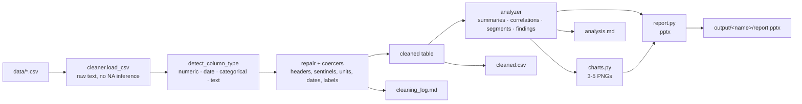

# survey2report

**Drop a folder of messy survey CSVs in, get a polished PowerPoint report out.**

[](https://github.com/your-org/survey2report/actions/workflows/ci.yml)
[](LICENSE)
[](pyproject.toml)

Survey exports arrive with inconsistent headers, duplicated rows, `N/A` placeholders, dates in
five formats and ratings written as `"4 - Agree"`. Getting from that to a deck people will
actually read is usually an afternoon of copy-paste. `survey2report` does the whole chain —
type detection, cleaning, analysis, charts, slides — in one command, and it writes down what it
changed so the numbers stay defensible.

```bash
survey2report --input ./data --output ./output
```

## Features

- **Automatic column typing** — every column is classified as numeric, date, categorical or free
  text from name hints plus whole-cell evidence, so `REG-2000` IDs are never mistaken for
  measurements and `feedback_date` is still recognised as a date.
- **Cleaning that explains itself** — whitespace, `N/A`/`null`/`-` placeholders, exact duplicate
  rows, blank rows, empty columns, currency symbols, trailing units, comma decimals,
  `YYYY-MM-DD`/`DD/MM/YYYY`/`Jan 9, 2024` dates and `Y`/`yes`/`1` answers are repaired with a
  counted entry per action in `cleaning_log.md`.
- **Analysis, not just totals** — descriptive statistics, correlations between measures, segment
  comparisons with a minimum meaningful gap, outlier flags and plain-English key findings.
- **Three to five charts per dataset** — distribution, category mix, segment gap, strongest
  correlation and monthly trend, each drawn with one consistent palette and a caption that says
  what to notice.
- **A real deck** — `python-pptx` output with a cover, key findings, one slide per chart, a
  methodology and data-quality slide, and appendix tables for metrics, categories and cleaning.
- **Fails soft** — a broken file is reported and skipped instead of ending the run.

## Install

```bash
git clone https://github.com/your-org/survey2report
cd survey2report
python -m venv .venv && source .venv/bin/activate   # Windows: .venv\Scripts\activate
pip install -e ".[dev]"
```

## Usage

```bash
# every CSV in ./data becomes output/<name>/report.pptx
survey2report --input ./data --output ./output

# cap the chart count (the deck is designed around three to five)
survey2report -i ./data -o ./output --max-charts 3
```

| Flag | Default | Purpose |
| --- | --- | --- |
| `-i`, `--input` | *required* | Folder containing survey CSV files |
| `-o`, `--output` | `./output` | Folder that receives one sub-folder per dataset |
| `-c`, `--max-charts` | `5` | Charts per dataset |
| `--version` | | Print the version and exit |

Each dataset produces:

```
output/<name>/
├── report.pptx         # cover, findings, charts, methodology, appendices
├── cleaned.csv         # the analysis-ready table, dates normalised to ISO
├── cleaning_log.md     # every repair, with counts and the reason
├── analysis.md         # statistics, correlations, segments and findings
└── charts/
    ├── 01_distribution.png
    ├── 02_categories.png
    ├── 03_segments.png
    ├── 04_correlation.png
    └── 05_trend.png
```

## Architecture



| Module | Responsibility |
| --- | --- |
| `cleaner.py` | Loads CSVs as raw text, types the columns, orchestrates the cleaning pipeline |
| `cleaner` helpers | `coerce.py` (numbers, labels, missing), `dates.py`, `repair.py`, `coercers.py` |
| `cleaninglog.py` | Structured record of every change plus its markdown rendering |
| `summaries.py` / `relationships.py` | Per-column statistics; correlations and segment comparisons |
| `analyzer.py` | Wires the analysis together and writes the key findings |
| `charts.py` | The three to five slide-ready PNGs |
| `slides.py` / `report.py` | Slide primitives, then the deck itself |
| `pipeline.py` / `cli.py` | One dataset end to end, and the command line entry point |

## Sample output

`examples/` holds five deliberately messy CSVs and `examples/make_samples.py` regenerates them
deterministically. `examples/output/` holds the committed result of running the tool over all
five (`python -m survey2report --input examples --output examples/output`).

Findings the tool produced for `examples/output/employee_engagement_2024/`:

> - 180 responses across 7 analysed columns
> - Most common would_recommend: Yes (35% of responses)
> - Strongest relationship: engagement_score ↔ manager_support (r = +0.88, strong positive)
> - Highest tenure_yrs by department: Support (6.4) vs Marketing (4.3)
> - 7 duplicate rows were removed during cleaning

Each generated deck has 11 slides: cover, key findings, five chart slides, methodology, and
appendix tables for metrics, categories and cleaning actions.

## Development

```bash
ruff check .      # lint
pytest -q         # test suite
pytest -q -k cleaner   # a single area
```

The suite covers coercion edge cases, type detection against all five samples, statistics,
chart files, deck structure and the CLI (including the failure path). CI runs `ruff check` and
`pytest` on Python 3.10 through 3.13.

## Roadmap

- [ ] Read `.xlsx` and Google Forms exports, not just CSV
- [ ] Crosstab and weighted analysis for stratified samples
- [ ] Word/PDF export alongside the `.pptx`
- [ ] Chart selection preferences (`--charts distribution,trend`)
- [ ] Support pandas 3.x (currently pinned to `<3` pending an API review)
- [ ] Optional LLM-written narrative for the findings slide

## License

MIT — see [LICENSE](LICENSE).
